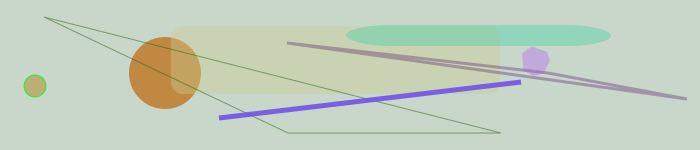
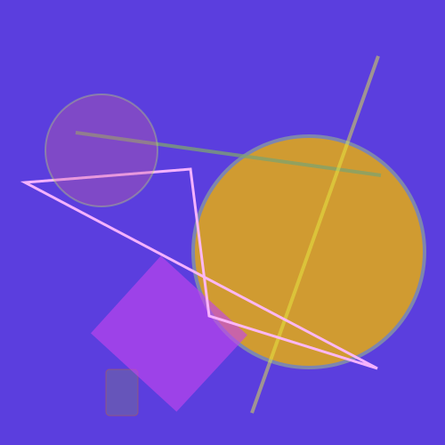

# randomPoly

this is a node script that runs with npm and generates random svg stuff

some practice in scripting is always a good idea :)
just making fun.

you can pass optional arguments to define the number of shapes (```-s```) and files (```-f```), height (```-h```) and width (```-w```) of a final image. Additionally you are able to change path output (```-o```).

#### examples
```
npm run poly -- -s 8 -w 700 -h 150
```
#### output:



#### some random pictures:




